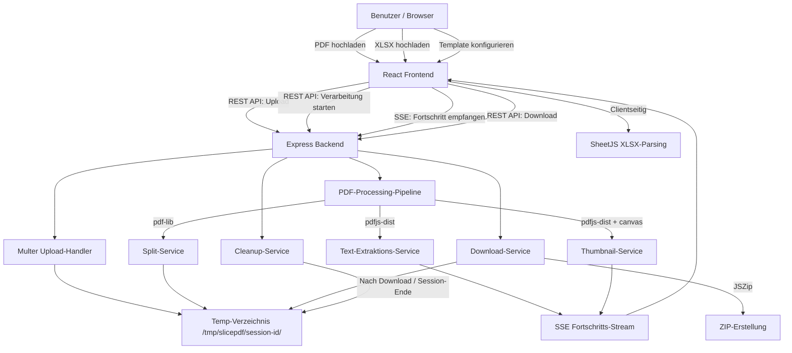
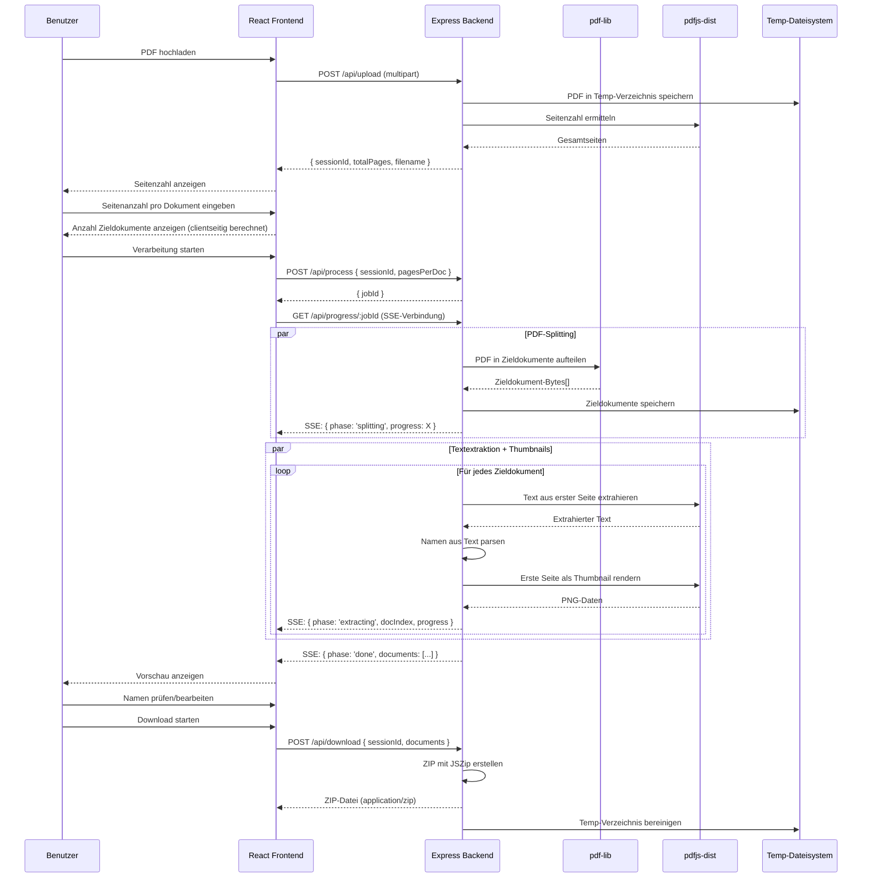
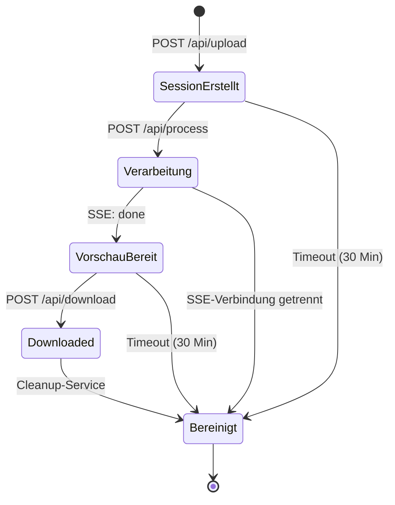

# Design-Dokument: slicePDF

## Übersicht

slicePDF ist eine Webanwendung mit React-Frontend und Node.js/Express-Backend zum Aufteilen großer PDF-Serienbriefe in einzelne Zieldokumente. Die rechenintensive PDF-Verarbeitung (Splitting, Textextraktion, Thumbnail-Generierung) findet serverseitig statt, um auch sehr große PDFs (500+ Seiten, 100+ MB) zuverlässig verarbeiten zu können. Das Frontend kommuniziert über REST-API-Aufrufe mit dem Backend und empfängt Echtzeit-Fortschrittsupdates via Server-Sent Events (SSE). XLSX-Parsing erfolgt clientseitig, da es leichtgewichtig ist und keine serverseitige Verarbeitung erfordert.

Alle hochgeladenen und erzeugten Dateien werden in temporären Verzeichnissen gespeichert und nach Download oder Sitzungsende automatisch bereinigt. Es wird keine Datenbank oder persistenter Speicher verwendet – der Datenschutz (Anforderung 9) wird durch konsequente temporäre Speicherung mit automatischem Cleanup gewährleistet.

### Technologie-Stack

| Komponente | Technologie | Begründung |
|---|---|---|
| **Frontend** | | |
| Framework | React + TypeScript | Komponentenbasierte UI, Typsicherheit |
| Build-Tool | Vite | Schnelle Entwicklung, optimiertes Bundling |
| XLSX-Parsing | [SheetJS (xlsx)](https://sheetjs.com/) | Leichtgewichtiges Parsing direkt im Browser |
| Styling | Tailwind CSS | Utility-first, schnelle UI-Entwicklung |
| **Backend** | | |
| Runtime | Node.js | JavaScript-Ökosystem, gleiche Sprache wie Frontend |
| Framework | [Express](https://expressjs.com/) | Minimalistisch, weit verbreitet, Middleware-Ökosystem |
| PDF-Splitting | [pdf-lib](https://pdf-lib.js.org/) | Seiten kopieren/erstellen, Formatierung erhalten |
| PDF-Textextraktion | [pdfjs-dist](https://mozilla.github.io/pdf.js/) | Textextraktion via `getTextContent()` serverseitig |
| PDF-Thumbnails | pdfjs-dist + [canvas](https://www.npmjs.com/package/canvas) | Serverseitiges Canvas-Rendering für Miniaturansichten |
| Datei-Upload | [Multer](https://github.com/expressjs/multer) | Multipart/form-data Handling, Disk-Storage |
| ZIP-Erstellung | [JSZip](https://stuk.github.io/jszip/) | ZIP-Archive serverseitig erstellen |
| Fortschritt | Server-Sent Events (SSE) | Unidirektionale Echtzeit-Updates, einfacher als WebSocket |

### Design-Entscheidungen

1. **Backend für PDF-Verarbeitung**: Große PDFs (500+ Seiten, 100+ MB) würden den Browser-Speicher überlasten. Node.js kann mit Streams und effizientem Speichermanagement auch sehr große Dateien verarbeiten.
2. **SSE statt WebSocket**: Fortschrittsupdates sind unidirektional (Server → Client). SSE ist einfacher zu implementieren, funktioniert über Standard-HTTP und benötigt keine zusätzliche Bibliothek.
3. **XLSX-Parsing bleibt clientseitig**: XLSX-Dateien sind typischerweise klein (wenige KB). SheetJS im Browser vermeidet einen unnötigen Server-Roundtrip und hält die Architektur einfach.
4. **Temporäre Verzeichnisse mit Session-ID**: Jede Upload-Session erhält ein eigenes temporäres Verzeichnis. Nach Download oder Verbindungsabbruch wird das Verzeichnis automatisch gelöscht.
5. **pdf-lib für Splitting, pdfjs-dist für Textextraktion**: pdf-lib manipuliert PDFs (kopieren, erstellen), pdfjs-dist liest und extrahiert Text. Beide ergänzen sich serverseitig.
6. **canvas-Paket für Thumbnails**: pdfjs-dist benötigt eine Canvas-Implementierung für das Rendering. Das `canvas`-NPM-Paket stellt dies serverseitig bereit.

## Architektur

### Systemübersicht




### Verarbeitungs-Pipeline



### Session-Lifecycle und Cleanup



**Cleanup-Auslöser:**
- Nach erfolgreichem ZIP-Download
- Bei SSE-Verbindungsabbruch (Browser geschlossen/neu geladen)
- Session-Timeout nach 30 Minuten Inaktivität
- Periodischer Cleanup-Job (alle 5 Minuten) für verwaiste Sessions


## Komponenten und Schnittstellen

### React-Komponentenstruktur (Frontend)

```
App
├── UploadPanel
│   ├── PdfUploader          // PDF-Datei hochladen via API
│   └── XlsxUploader         // XLSX-Datei hochladen (clientseitig parsen)
├── ConfigPanel
│   ├── PageCountInput       // Seitenanzahl pro Dokument
│   ├── TemplateEditor       // Dateinamen-Template bearbeiten
│   │   ├── VariableChips    // Verfügbare Variablen als klickbare Chips
│   │   ├── DateFormatPicker // Datumsformat konfigurieren
│   │   └── LivePreview      // Echtzeit-Vorschau des Dateinamens
│   └── CustomVariableManager // Benutzerdefinierte Variablen verwalten
├── PreviewPanel
│   ├── DocumentList         // Liste aller Zieldokumente
│   │   └── DocumentCard     // Einzelnes Dokument: Thumbnail, Name, Bearbeitung
│   └── ProcessingIndicator  // Fortschrittsanzeige (SSE-basiert)
└── DownloadPanel
    ├── ZipDownloadButton    // Alle als ZIP herunterladen
    └── SingleDownloadButton // Einzelnes Dokument herunterladen
```

### Backend-Struktur

```
server/
├── index.ts                 // Express-Server, Middleware-Setup
├── routes/
│   ├── upload.ts            // POST /api/upload – PDF-Upload
│   ├── process.ts           // POST /api/process – Verarbeitung starten
│   ├── progress.ts          // GET /api/progress/:jobId – SSE-Stream
│   ├── download.ts          // POST /api/download – ZIP/Einzeldatei
│   └── cleanup.ts           // DELETE /api/session/:sessionId
├── services/
│   ├── pdfSplitService.ts   // PDF aufteilen mit pdf-lib
│   ├── textExtractionService.ts // Text extrahieren mit pdfjs-dist
│   ├── thumbnailService.ts  // Thumbnails rendern mit pdfjs-dist + canvas
│   ├── nameExtractionService.ts // Namen aus Text parsen
│   ├── templateEngine.ts    // Dateinamen-Template verarbeiten
│   ├── downloadService.ts   // ZIP erstellen mit JSZip
│   └── cleanupService.ts    // Temp-Verzeichnisse bereinigen
├── middleware/
│   ├── uploadMiddleware.ts  // Multer-Konfiguration
│   └── sessionMiddleware.ts // Session-ID-Verwaltung
└── utils/
    ├── sessionStore.ts      // In-Memory Session-Verwaltung
    └── tempDir.ts           // Temp-Verzeichnis-Hilfsfunktionen
```


### REST-API-Schnittstellen

#### POST /api/upload

PDF-Datei hochladen und Session erstellen.

```typescript
// Request: multipart/form-data mit Feld "pdf"
// Response:
interface UploadResponse {
  sessionId: string;       // UUID für diese Session
  totalPages: number;      // Gesamtseitenzahl der PDF
  filename: string;        // Originaler Dateiname
}

// Fehler:
// 400 – Keine Datei oder ungültiges PDF-Format
// 413 – Datei zu groß (Limit konfigurierbar, Standard: 200 MB)
```

#### POST /api/process

Verarbeitung starten (Splitting, Textextraktion, Thumbnails).

```typescript
// Request:
interface ProcessRequest {
  sessionId: string;
  pagesPerDocument: number;
  extractNames: boolean;    // Automatische Namensextraktion aktivieren
}

// Response:
interface ProcessResponse {
  jobId: string;            // Job-ID für SSE-Fortschritt
}

// Fehler:
// 400 – Ungültige Parameter
// 404 – Session nicht gefunden
```

#### GET /api/progress/:jobId

Server-Sent Events Stream für Echtzeit-Fortschrittsupdates.

```typescript
// SSE-Events:
interface ProgressEvent {
  phase: 'splitting' | 'extracting' | 'thumbnails' | 'done' | 'error';
  progress: number;         // 0-100 Gesamtfortschritt
  currentDoc?: number;      // Aktuelles Dokument (0-basiert)
  totalDocs?: number;       // Gesamtanzahl Dokumente
  message?: string;         // Statusmeldung
}

// Bei phase === 'done':
interface DoneEvent extends ProgressEvent {
  phase: 'done';
  documents: DocumentInfo[];
}

interface DocumentInfo {
  index: number;
  pageRange: { start: number; end: number };
  extractedName: { vorname: string; nachname: string } | null;
  extractionFailed: boolean;
  thumbnailUrl: string;     // Relativer Pfad zum Thumbnail
}
```

#### POST /api/download

ZIP-Archiv oder Einzeldatei herunterladen.

```typescript
// Request:
interface DownloadRequest {
  sessionId: string;
  documents: DownloadDocument[];
  mode: 'zip' | 'single';
  singleIndex?: number;     // Nur bei mode === 'single'
}

interface DownloadDocument {
  index: number;
  filename: string;         // Gewünschter Dateiname (mit .pdf)
}

// Response: application/zip oder application/pdf (Binary-Stream)
```

#### GET /api/thumbnail/:sessionId/:docIndex

Thumbnail-Bild eines Zieldokuments abrufen.

```typescript
// Response: image/png (Binary)
// Fehler:
// 404 – Session oder Dokument nicht gefunden
```

#### DELETE /api/session/:sessionId

Session und alle zugehörigen Dateien manuell bereinigen.

```typescript
// Response:
interface CleanupResponse {
  success: boolean;
  message: string;
}
```

### Service-Schicht (Backend)

#### PdfSplitService

```typescript
interface PdfSplitService {
  // PDF in Zieldokumente aufteilen und als Dateien speichern
  splitPdf(
    sourcePath: string,
    pagesPerDoc: number,
    outputDir: string,
    onProgress: (progress: number) => void
  ): Promise<SplitResult[]>;
}

interface SplitResult {
  index: number;
  filePath: string;         // Pfad zur erzeugten PDF-Datei
  pageRange: { start: number; end: number };
  pageCount: number;
}
```

#### TextExtractionService

```typescript
interface TextExtractionService {
  // Text aus einer bestimmten Seite einer PDF-Datei extrahieren
  extractTextFromPage(pdfPath: string, pageIndex: number): Promise<string>;
}
```

#### ThumbnailService

```typescript
interface ThumbnailService {
  // Thumbnail der ersten Seite als PNG-Datei rendern
  renderThumbnail(
    pdfPath: string,
    pageIndex: number,
    outputPath: string,
    scale: number
  ): Promise<string>; // Pfad zur PNG-Datei
}
```

#### NameExtractionService

```typescript
interface NameExtractionService {
  // Namen aus extrahiertem Text parsen
  extractName(text: string): ExtractedName | null;
}

interface ExtractedName {
  vorname: string;
  nachname: string;
  raw: string;              // Original-Textfragment
}
```

### Service-Schicht (Frontend – clientseitig)

#### XlsxService (clientseitig)

```typescript
interface XlsxService {
  // XLSX laden und Spaltenüberschriften auslesen
  loadXlsx(file: File): Promise<XlsxInfo>;
  
  // Daten aus ausgewählten Spalten lesen
  readColumns(
    xlsxData: XlsxInfo,
    vornameColumn: string,
    nachnameColumn: string
  ): NameMapping[];
}

interface XlsxInfo {
  headers: string[];        // Alle Spaltenüberschriften
  rowCount: number;         // Anzahl Datenzeilen
  sheetName: string;        // Name des aktiven Sheets
  rawData: unknown[][];     // Rohdaten für zusätzliche Variablen
}

interface NameMapping {
  vorname: string;
  nachname: string;
  additionalFields: Record<string, string>; // Weitere Spalten als Variablen
}
```

#### TemplateEngine (clientseitig)

```typescript
interface TemplateEngine {
  // Template parsen und Variablen extrahieren
  parseTemplate(template: string): TemplatePart[];
  
  // Dateinamen aus Template und Variablenwerten generieren
  generateFilename(template: string, variables: TemplateVariables): string;
  
  // Verfügbare Variablen auflisten
  getAvailableVariables(customVars: CustomVariable[], xlsxHeaders: string[]): VariableDefinition[];
  
  // Template validieren
  validateTemplate(template: string, availableVars: string[]): ValidationResult;
}

interface TemplateVariables {
  nachname: string;
  vorname: string;
  dokument: string;
  datum: string;
  nummer: number;
  [key: string]: string | number; // Benutzerdefinierte + XLSX-Variablen
}

interface TemplatePart {
  type: 'literal' | 'variable';
  value: string;
}

interface VariableDefinition {
  name: string;             // z.B. "Nachname"
  key: string;              // z.B. "nachname"
  source: 'system' | 'xlsx' | 'custom';
  description: string;
}

interface CustomVariable {
  key: string;
  label: string;
  value: string;            // Globaler Wert für alle Dokumente
}

interface ValidationResult {
  valid: boolean;
  warnings: string[];       // z.B. "Keine Variablen im Template"
  errors: string[];
}
```

### Session-Verwaltung (Backend)

```typescript
interface SessionStore {
  // Session erstellen
  createSession(sessionId: string, tempDir: string): void;
  
  // Session abrufen
  getSession(sessionId: string): SessionData | null;
  
  // Session aktualisieren
  updateSession(sessionId: string, update: Partial<SessionData>): void;
  
  // Session und Dateien bereinigen
  destroySession(sessionId: string): Promise<void>;
  
  // Verwaiste Sessions bereinigen (älter als maxAge)
  cleanupExpiredSessions(maxAgeMs: number): Promise<number>;
}

interface SessionData {
  sessionId: string;
  tempDir: string;          // Pfad zum Temp-Verzeichnis
  createdAt: number;        // Timestamp
  lastActivity: number;     // Timestamp der letzten Aktivität
  sourcePdfPath: string | null;
  totalPages: number;
  splitDocuments: SplitResult[];
  jobId: string | null;
  status: 'uploaded' | 'processing' | 'done' | 'error';
}
```


## Datenmodelle

### Frontend-Anwendungszustand

```typescript
interface AppState {
  // Session
  sessionId: string | null;
  
  // Upload-Phase
  sourcePdf: SourcePdfState | null;
  xlsxData: XlsxState | null;
  
  // Konfiguration
  pagesPerDocument: number;
  filenameTemplate: string;
  dateFormat: string;
  customVariables: CustomVariable[];
  
  // Verarbeitung
  processing: ProcessingState;
  
  // Ergebnis
  documents: DocumentState[];
}

interface SourcePdfState {
  filename: string;
  totalPages: number;
  fileSize: number;         // Dateigröße in Bytes
}

interface XlsxState {
  file: File;               // Clientseitig gehalten
  info: XlsxInfo;
  vornameColumn: string | null;
  nachnameColumn: string | null;
  mappings: NameMapping[];
}

interface ProcessingState {
  status: 'idle' | 'uploading' | 'splitting' | 'extracting' | 'thumbnails' | 'done' | 'error';
  progress: number;         // 0-100
  currentDoc: number | null;
  totalDocs: number | null;
  message: string | null;
  error: string | null;
}

interface DocumentState {
  index: number;                    // Laufende Nummer (0-basiert)
  pageRange: { start: number; end: number };
  
  // Namensextraktion (vom Backend)
  extractedName: ExtractedName | null;
  nameSource: 'extracted' | 'xlsx' | 'manual';
  extractionFailed: boolean;
  
  // Bearbeitbare Felder
  vorname: string;
  nachname: string;
  
  // Vorschau
  thumbnailUrl: string | null;      // URL zum Backend-Thumbnail-Endpoint
  
  // Generierter Dateiname (clientseitig berechnet)
  generatedFilename: string;
}
```

### Template-Variablen-System

Die Variablen im Dateinamen-Template werden in eckigen Klammern notiert: `[Variablenname]`.

**System-Variablen** (immer verfügbar):

| Variable | Schlüssel | Beschreibung | Beispielwert |
|---|---|---|---|
| `[Nachname]` | `nachname` | Nachname des Empfängers | `Malcherek` |
| `[Vorname]` | `vorname` | Vorname des Empfängers | `Tobias` |
| `[Dokument]` | `dokument` | Dokumententyp/-bezeichnung | `Endabrechnung Bonus` |
| `[Datum]` | `datum` | Datum im konfigurierten Format | `29.04.2025` |
| `[Nummer]` | `nummer` | Laufende Nummer (1-basiert) | `1` |

**XLSX-Variablen** (dynamisch aus Spaltenüberschriften):
Wenn eine XLSX-Datei hochgeladen wird, werden alle Spaltenüberschriften automatisch als zusätzliche Variablen verfügbar. Beispiel: Spalte "Abteilung" → Variable `[Abteilung]`.

**Benutzerdefinierte Variablen**:
Der Benutzer kann eigene Variablen mit globalem Wert definieren. Beispiel: Variable `[Dokument]` mit Wert "Endabrechnung Bonus" wird in allen Dateinamen eingesetzt.

### Standard-Template

```
[Nachname], [Vorname]_[Dokument] - [Datum]
```

Ergibt z.B.: `Malcherek, Tobias_Endabrechnung Bonus - 29.04.2025.pdf`

### Template-Parsing

Das Template wird in Teile zerlegt:
- **Literal**: Fester Text (Komma, Leerzeichen, Unterstrich, Bindestrich etc.)
- **Variable**: Text in eckigen Klammern `[...]`

Beispiel für `[Nachname], [Vorname]_[Dokument] - [Datum]`:
```
[
  { type: 'variable', value: 'Nachname' },
  { type: 'literal',  value: ', ' },
  { type: 'variable', value: 'Vorname' },
  { type: 'literal',  value: '_' },
  { type: 'variable', value: 'Dokument' },
  { type: 'literal',  value: ' - ' },
  { type: 'variable', value: 'Datum' }
]
```

### Namensextraktion-Strategie

Die automatische Namensextraktion aus dem PDF-Text der ersten Seite eines Zieldokuments verwendet folgende Heuristik (serverseitig):

1. **Text extrahieren**: pdfjs-dist `getTextContent()` liefert Textfragmente mit Position (serverseitig)
2. **Erste Zeilen analysieren**: Die ersten Textfragmente (typischerweise Adressblock) werden nach Namensmustern durchsucht
3. **Muster-Matching**: Reguläre Ausdrücke für gängige Namensformate:
   - `Vorname Nachname`
   - `Nachname, Vorname`
   - `Herr/Frau Vorname Nachname`
4. **Fallback**: Wenn kein Muster passt → `extractionFailed = true`, Markierung in der Vorschau

Die Namensextraktion ist bewusst heuristisch und nicht perfekt. Die XLSX-Fallback-Option und die manuelle Bearbeitung in der Vorschau kompensieren Fehler.

### Temporäres Dateisystem

```
/tmp/slicepdf/
├── {session-uuid-1}/
│   ├── source.pdf              // Hochgeladene Quell-PDF
│   ├── documents/
│   │   ├── doc-000.pdf         // Zieldokument 1
│   │   ├── doc-001.pdf         // Zieldokument 2
│   │   └── ...
│   └── thumbnails/
│       ├── thumb-000.png       // Thumbnail Dokument 1
│       ├── thumb-001.png       // Thumbnail Dokument 2
│       └── ...
├── {session-uuid-2}/
│   └── ...
```


## Korrektheitseigenschaften

*Eine Korrektheitseigenschaft ist ein Merkmal oder Verhalten, das für alle gültigen Ausführungen eines Systems gelten muss – im Wesentlichen eine formale Aussage darüber, was das System tun soll. Eigenschaften bilden die Brücke zwischen menschenlesbaren Spezifikationen und maschinell überprüfbaren Korrektheitsgarantien.*

### Property 1: Aufteilungsberechnung

*Für alle* gültigen Kombinationen von Gesamtseitenzahl (totalPages > 0) und Seiten pro Dokument (pagesPerDoc > 0) soll die berechnete Anzahl der Zieldokumente gleich `Math.ceil(totalPages / pagesPerDoc)` sein, und das letzte Zieldokument soll genau `totalPages % pagesPerDoc || pagesPerDoc` Seiten enthalten.

**Validiert: Anforderungen 2.2, 2.4**

### Property 2: XLSX-Namenszuordnung in Reihenfolge

*Für alle* gültigen XLSX-Datensätze mit n Zeilen und einer Liste von n Zieldokumenten soll die Zuordnung so erfolgen, dass Zeile i (0-basiert) dem Zieldokument i zugeordnet wird, wobei Vorname und Nachname aus den ausgewählten Spalten korrekt übernommen werden.

**Validiert: Anforderungen 4.4**

### Property 3: Template-Variablen-Ersetzung und Dateiendung

*Für alle* gültigen Templates und beliebige Variablenwerte soll `generateFilename(template, variables)` jeden Variablenplatzhalter `[Name]` durch den entsprechenden Wert ersetzen, alle Literal-Teile unverändert beibehalten, und der resultierende Dateiname soll immer auf `.pdf` enden.

**Validiert: Anforderungen 5.2, 5.10**

### Property 4: XLSX-Spaltenüberschriften als Template-Variablen

*Für alle* gültigen Listen von XLSX-Spaltenüberschriften soll jede Überschrift als verfügbare Variable im Template-System erscheinen, sodass die Menge der XLSX-basierten Variablen exakt der Menge der Spaltenüberschriften entspricht.

**Validiert: Anforderungen 4.2, 5.5**

### Property 5: Template-Validierung bei fehlenden Variablen

*Für alle* Strings, die keinen Teilstring der Form `[...]` enthalten, soll `validateTemplate` eine Warnung zurückgeben, die darauf hinweist, dass der Dateiname für alle Dokumente identisch wäre.

**Validiert: Anforderungen 5.8**

### Property 6: ZIP-Dateinamen entsprechen generierten Namen

*Für alle* Listen von Zieldokumenten mit generierten Dateinamen soll das erzeugte ZIP-Archiv für jedes Dokument einen Eintrag enthalten, dessen Name exakt dem generierten Dateinamen entspricht.

**Validiert: Anforderungen 7.2**

### Property 7: PDF-Split-Round-Trip

*Für alle* gültigen PDF-Dokumente und beliebige Seitenanzahl pro Dokument soll das Aufteilen der Quell-PDF in Zieldokumente und das anschließende Zusammenfügen aller Zieldokumente ein Dokument ergeben, das seitenweise identisch mit der Quell-PDF ist.

**Validiert: Anforderungen 8.4**

### Property 8: Session-Cleanup bereinigt alle temporären Dateien

*Für alle* Sessions, die Dateien hochgeladen und verarbeitet haben, soll nach Aufruf von `destroySession` das zugehörige temporäre Verzeichnis vollständig gelöscht sein und keine Dateien oder Unterverzeichnisse mehr enthalten.

**Validiert: Anforderungen 9.1, 9.2, 9.4**


## Fehlerbehandlung

### Fehlerszenarien und Reaktionen

| Szenario | Erkennung | Benutzer-Feedback |
|---|---|---|
| Ungültige PDF-Datei | Magic-Bytes-Prüfung (`%PDF-`) und pdf-lib Load-Fehler (Backend) | Fehlermeldung: "Die hochgeladene Datei ist kein gültiges PDF." |
| Ungültige XLSX-Datei | SheetJS Parse-Fehler (Frontend) | Fehlermeldung: "Die hochgeladene Datei ist kein gültiges XLSX-Format." |
| Seitenanzahl < 1 | Eingabevalidierung (Frontend + Backend) | Fehlermeldung: "Bitte geben Sie eine Seitenanzahl von mindestens 1 ein." |
| Seitenanzahl > Gesamtseiten | Eingabevalidierung (Frontend + Backend) | Fehlermeldung: "Die Seitenanzahl pro Dokument darf die Gesamtseitenzahl nicht überschreiten." |
| Nicht-teilbare Seitenzahl | `totalPages % pagesPerDoc !== 0` | Warnung: "Die Gesamtseitenzahl ist nicht gleichmäßig teilbar. Das letzte Dokument enthält X Seiten." |
| Namensextraktion fehlgeschlagen | `extractName()` gibt `null` zurück (Backend) | Visuell hervorgehobenes Dokument mit "Name nicht erkannt", editierbar |
| XLSX-Zeilenanzahl ≠ Dokumentanzahl | Vergleich nach Zuordnung (Frontend) | Warnung: "Die XLSX-Datei enthält X Zeilen, es gibt aber Y Zieldokumente." |
| Template ohne Variablen | `validateTemplate()` findet keine `[...]` (Frontend) | Warnung: "Das Template enthält keine Variablen. Alle Dateinamen wären identisch." |
| PDF-Verarbeitung schlägt fehl | try/catch um pdf-lib/pdfjs-Operationen (Backend) | SSE-Event mit `phase: 'error'` und Fehlermeldung |
| Datei zu groß | Multer-Limit überschritten (Backend) | Fehlermeldung: "Die Datei überschreitet die maximale Größe von 200 MB." |
| Upload-Fehler / Netzwerkfehler | HTTP-Fehlercode oder Timeout (Frontend) | Fehlermeldung: "Upload fehlgeschlagen. Bitte prüfen Sie Ihre Verbindung." |
| SSE-Verbindung unterbrochen | EventSource `onerror` (Frontend) | Fehlermeldung: "Verbindung zum Server unterbrochen. Bitte versuchen Sie es erneut." |
| Session nicht gefunden | 404 vom Backend | Fehlermeldung: "Sitzung abgelaufen. Bitte laden Sie die PDF-Datei erneut hoch." |
| Session-Timeout | Cleanup-Service erkennt abgelaufene Session | Automatische Bereinigung, bei erneutem Zugriff: 404 |

### Fehlerbehandlungs-Strategie

1. **Validierung auf beiden Seiten**: Eingaben werden sowohl im Frontend (schnelles Feedback) als auch im Backend (Sicherheit) validiert.
2. **Graceful Degradation**: Wenn die Namensextraktion fehlschlägt, wird nicht abgebrochen, sondern das Dokument als "Name nicht erkannt" markiert. Der Benutzer kann den Namen manuell eingeben.
3. **Keine stillen Fehler**: Jeder Fehler wird dem Benutzer sichtbar kommuniziert – entweder über die API-Response oder über SSE-Events.
4. **SSE-Fehler-Events**: Bei Fehlern während der Verarbeitung sendet das Backend ein SSE-Event mit `phase: 'error'` und einer Fehlermeldung. Das Frontend zeigt diese an und bietet die Möglichkeit, die Verarbeitung erneut zu starten.
5. **Automatischer Cleanup bei Fehlern**: Auch bei Fehlern werden temporäre Dateien bereinigt (über Session-Timeout oder expliziten Cleanup).
6. **Retry-Logik**: Bei Netzwerkfehlern bietet das Frontend eine "Erneut versuchen"-Option. Die SSE-Verbindung wird bei Abbruch automatisch neu aufgebaut (EventSource reconnect).

## Teststrategie

### Dualer Testansatz

Die Teststrategie kombiniert Unit-Tests für spezifische Beispiele und Edge-Cases mit Property-Based Tests für universelle Korrektheitseigenschaften.

### Property-Based Tests (fast-check)

**Bibliothek**: [fast-check](https://fast-check.dev/) – Property-Based Testing für TypeScript/JavaScript

**Konfiguration**: Minimum 100 Iterationen pro Property-Test

Jeder Property-Test referenziert die entsprechende Korrektheitseigenschaft aus dem Design-Dokument:

| Property | Test-Tag | Beschreibung |
|---|---|---|
| Property 1 | `Feature: pdf-serial-letter-splitter, Property 1: Aufteilungsberechnung` | Berechnung der Zieldokument-Anzahl und Restseiten |
| Property 2 | `Feature: pdf-serial-letter-splitter, Property 2: XLSX-Namenszuordnung` | Reihenfolge-treue Zuordnung von XLSX-Zeilen zu Dokumenten |
| Property 3 | `Feature: pdf-serial-letter-splitter, Property 3: Template-Variablen-Ersetzung` | Korrekte Variablenersetzung und .pdf-Endung |
| Property 4 | `Feature: pdf-serial-letter-splitter, Property 4: XLSX-Headers als Variablen` | XLSX-Spaltenüberschriften werden zu Template-Variablen |
| Property 5 | `Feature: pdf-serial-letter-splitter, Property 5: Template-Validierung` | Warnung bei Templates ohne Variablen |
| Property 6 | `Feature: pdf-serial-letter-splitter, Property 6: ZIP-Dateinamen` | ZIP-Einträge haben korrekte Dateinamen |
| Property 7 | `Feature: pdf-serial-letter-splitter, Property 7: PDF-Split-Round-Trip` | Split + Merge = Original (serverseitig) |
| Property 8 | `Feature: pdf-serial-letter-splitter, Property 8: Session-Cleanup` | Temp-Verzeichnis nach destroySession vollständig gelöscht |

### Unit-Tests (Vitest)

**Bibliothek**: [Vitest](https://vitest.dev/)

**Fokus**:
- Spezifische Beispiele für Namensextraktion (verschiedene Adressblock-Formate)
- Edge-Cases: leere PDFs, einzelne Seite, ungültige Eingaben
- API-Endpunkt-Tests: Upload-Validierung, Fehlerresponses
- Template-Engine: Spezifische Template-Muster, Sonderzeichen
- Fehlerbehandlung: ungültige Dateien, Session-Timeout
- Frontend-Komponenten: Upload, Vorschau, Template-Editor

### Integrationstests

- PDF-Upload → Verarbeitung → SSE-Fortschritt → Vorschau → Download (End-to-End)
- XLSX-Upload (clientseitig) → Spaltenzuordnung → Namensübernahme in Vorschau
- Template-Konfiguration → Live-Vorschau → Dateinamengenerierung
- Session-Lifecycle: Upload → Verarbeitung → Download → Cleanup
- SSE-Verbindungsabbruch → Cleanup-Auslösung
- Große PDF-Verarbeitung (Performance-Test mit 500+ Seiten)
